## Git commands used for exercises

### ==2==

##### `git clone git@github.com:hreis00/final-git-exercises.git`

##### `cd final-git-exercises`

##### `code .`

### ==3==

##### `git checkout -b dev`

##### `git push -u origin dev`

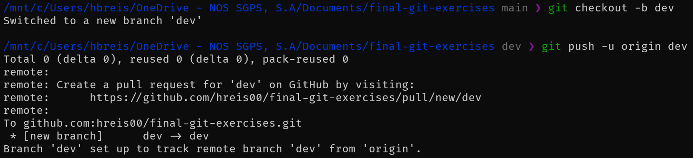

### ==4==

##### `git checkout -b task-04-add-readme`

##### `git add README.md`

##### `git commit -m "Updated README.md"`

##### `git push -u origin task-04-add-readme`

##### `git checkout dev`

##### `git merge task-04-add-readme`

##### `git push`

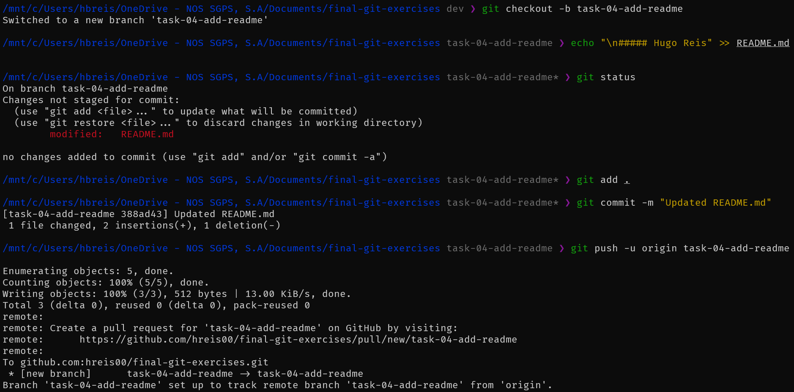
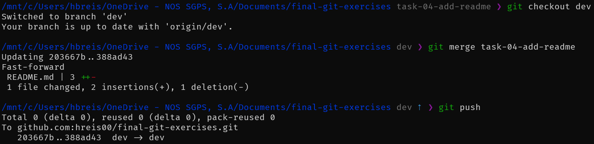

### ==5==

##### `git checkout -b task-05-add-basic-boilerplate`

##### `touch .gitignore`

##### `git add .`

##### `git commit -m "Added .gitignore and Updated README.md"`

##### `git push -u origin task-05-add-basic-boilerplate`

##### `git checkout dev`

##### `git merge task-05-add-basic-boilerplate`

##### `git push`

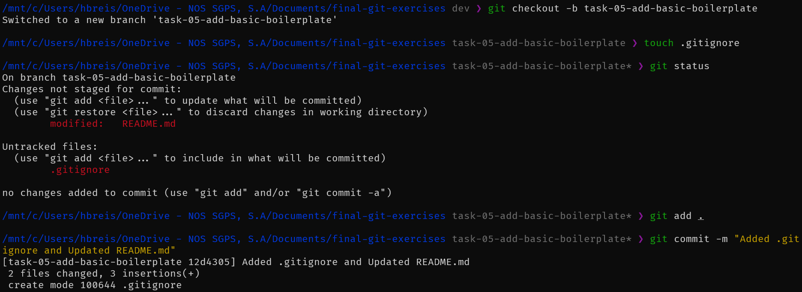
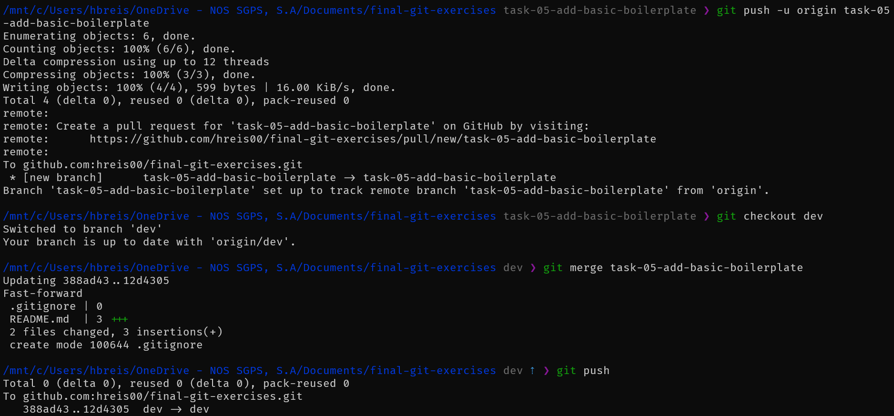

### ==6==

##### `git log`

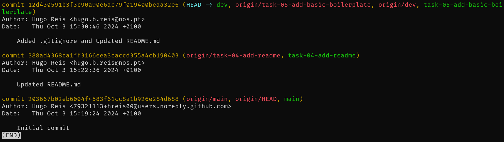

### ==7==

##### `git checkout -b task-07-greet-python-app`

##### `touch app.py`

##### `git add .`

##### `git commit -m "Added app.py and Updated README.md with instructions"`

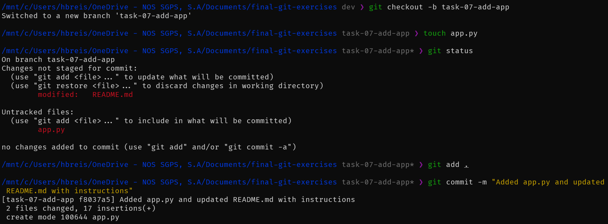

### ==8==

##### `git checkout -b task-08-add-source-app`

##### `mkdir source`

##### `cd source`

##### `touch app.py`

##### `cd ..`

##### `git add .`

##### `git commit -m "Added source/app.py and Updated README.md with instructions"`

##### `git push -u origin task-08-add-source-app`

##### `git checkout dev`

##### `git merge task-08-add-source-app`

##### `git push`

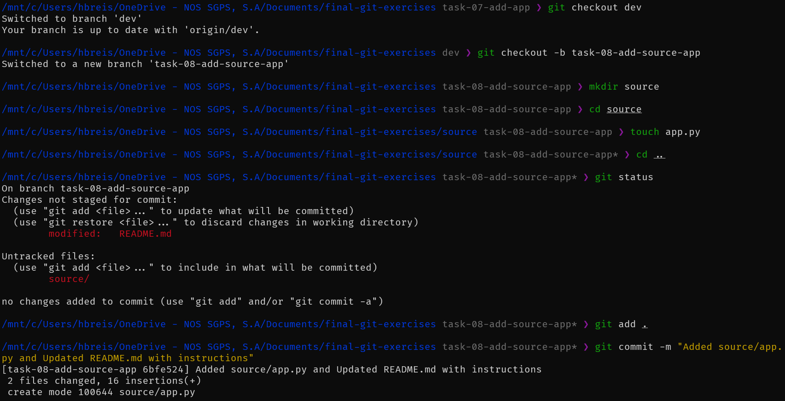
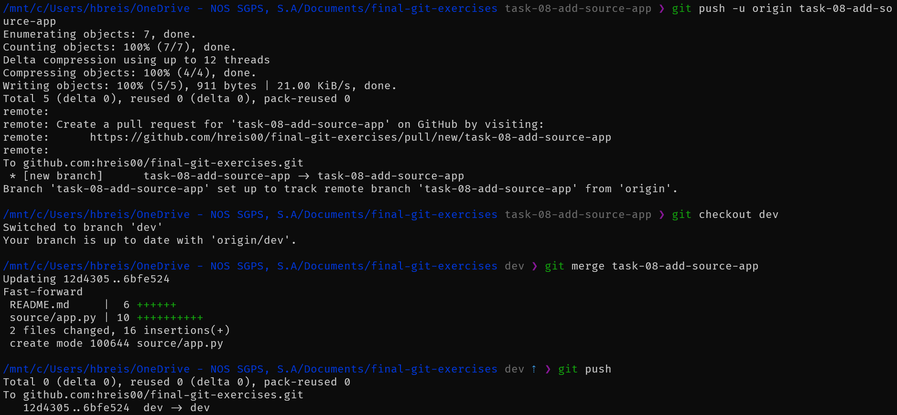

### ==8.1==

##### `git checkout main`

##### `git merge dev`

##### `git tag -a 0.0.1 -m "Preview version v0.0.1"`

##### `git push --tags`

##### `git push`

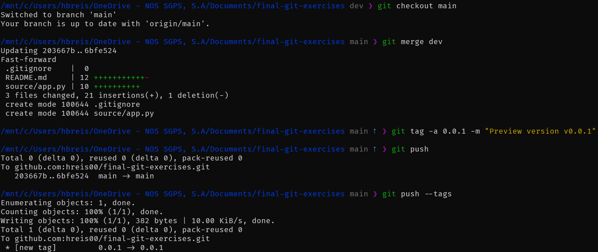

### ==8.2==

##### `git checkout task-07-add-app`

##### `git add .`

##### `git commit -m "Merged task-07 into dev"`

##### `git checkout dev`

##### `git merge task-07-add-app`

### ==8.3==

##### `git checkout main`

##### `git merge dev`

##### `git push`

##### `git tag -a 1.0.0 -m "First release"`

##### `git push --tags`

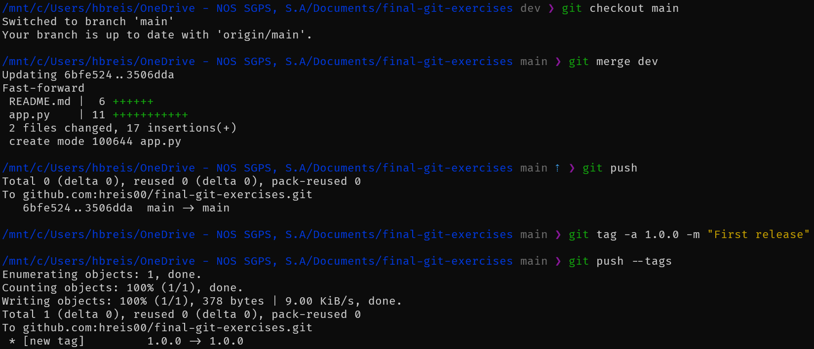

### ==8.4==

##### `git checkout dev`

##### `git checkout -b feature-advanced-feature`

##### `touch counter.txt`

##### `git add counter.txt`

##### `git commit -m "write 1 to counter.txt"`

##### `git add counter.txt`

##### `git commit -m "write 2 to counter.txt"`

##### `git add counter.txt`

##### `git commit -m "write 3 to counter.txt"`

##### `git checkout -b feature-fork-advanced-feature`

##### `git rebase -i HEAD~3`

##### `git push -u origin feature-fork-advanced-feature`

##### `git checkout dev`

##### `git merge feature-fork-advanced-feature`

##### `git push`

##### `git checkout main`

##### `git merge dev`

##### `git push`

##### `git tag -a 1.0.1 -m "Minor Update release"`

##### `git push --tags`

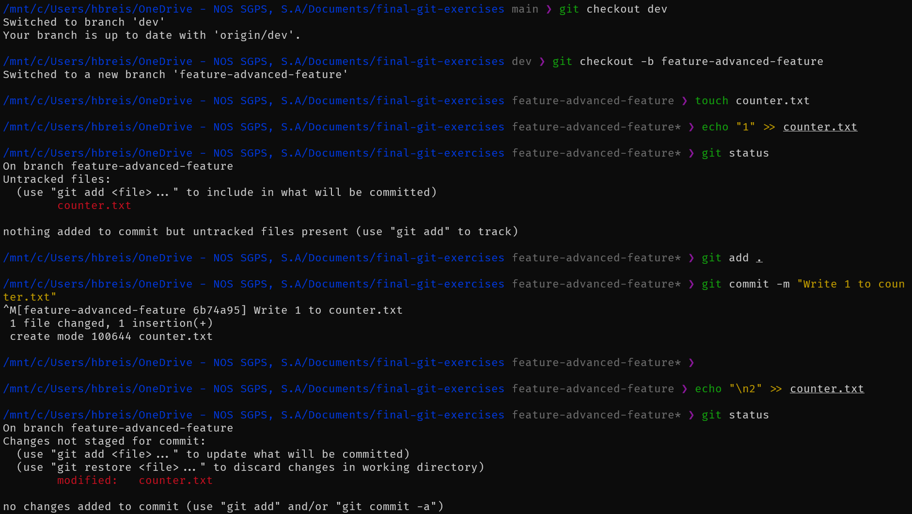
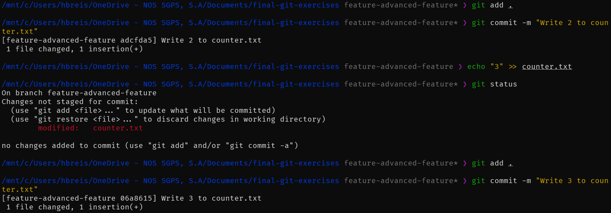
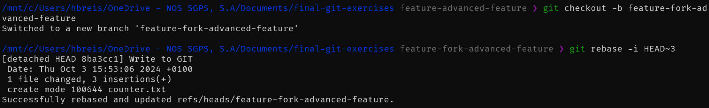
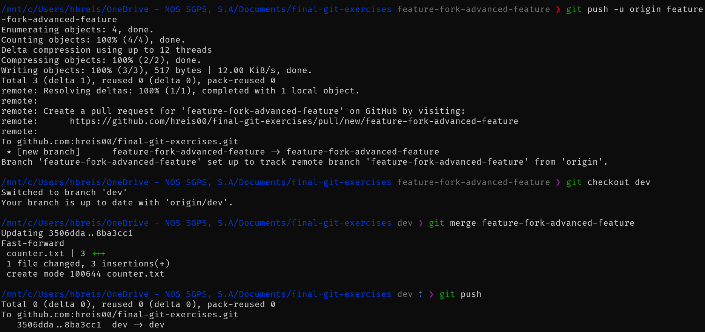
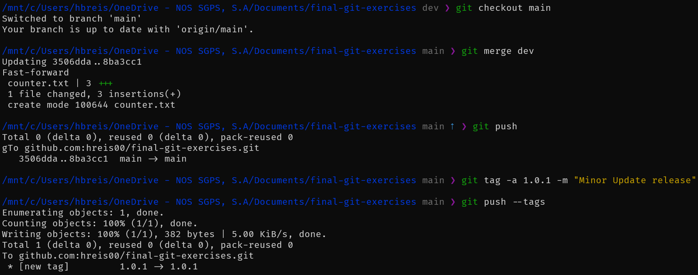

### ==8.5==

##### `git log --graph --all --pretty=format:'%Cred%x09%h %Creset%ad%C(bold yellow)%d %C(dim cyan) %s %C(reset)(%an)%Creset'`

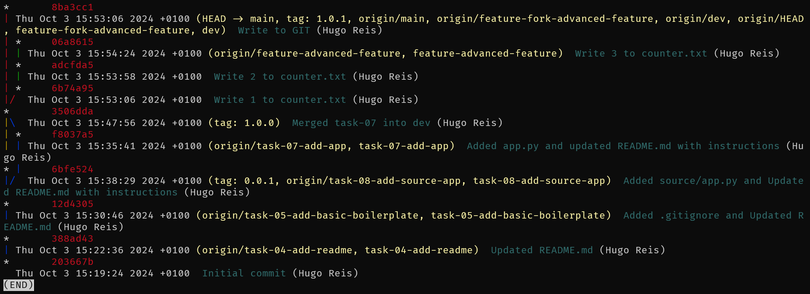
